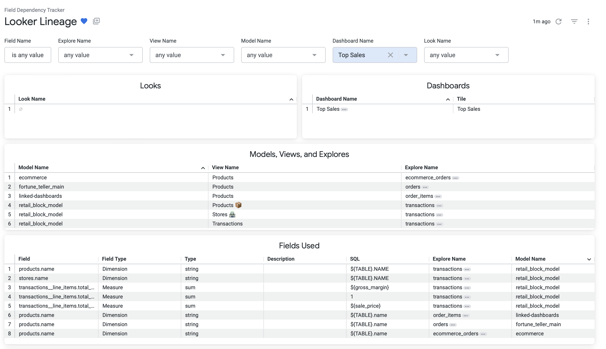

# Looker Lineage Dashboard

---

## Overview

Our team at the 2024 Looker Hackathon created a **Lineage Dashboard** for Looker, enabling users to find all references to a field, view, explore, look, or dashboard within a Looker instance. This tool provides a comprehensive lineage of where and how these elements are used, helping users understand the downstream impact of changes.

---

## Problem Statement

When working in Looker, you may need to modify a field, view, or other elements. While Looker provides a **Content Validator** for catching changes that would result in errors (e.g., breaking visualizations due to field type changes), it lacks a way to track:

- **Non-breaking changes**: For instance, if you change a field’s description or update the custom SQL that defines a field, there’s no visibility into how these changes ripple through your Looker instance.
- **Upstream changes**: If a field’s definition changes in a data source (e.g., a DBT model), Looker won’t highlight the downstream impacts if the column name and type remain the same but the data itself changes (e.g., modified filters affecting calculations).

---

## Solution

The Looker Lineage Dashboard fills this gap by:

- **Tracing all references** to a field, view, explore, look, or dashboard.
- **Providing visibility** into where changes propagate, whether or not they throw an error.
- Supporting **proactive impact analysis**, ensuring users can confidently make changes while understanding their full scope.

### Example Use Cases

1. **Updating a Field Description**: Determine all dashboards, looks, and explores that reference a field whose description is being updated.
2. **Modifying Custom SQL**: Find all downstream visualizations, filters, and calculations that depend on a custom SQL field.
3. **Addressing Upstream Changes**: Identify all locations affected by changes in a DBT model, even if the column name and type remain unchanged.

---

## Features

✨ **Full Lineage Mapping**: Trace references to fields, views, explores, looks, and dashboards across your Looker instance.

🚦 **Non-breaking Change Detection**: Identify changes that don't result in immediate errors but may still impact data interpretations.

🔍 **Customizable Insights**: Drill down into specific fields or views to analyze their dependencies.

---

## Visual Output

Below are examples of the Looker Lineage Dashboard in action, filtered for a specific dashboard called **Top Sales**:

### Dashboard View

*This image showcases the primary view of the Looker Lineage Dashboard, filtered to show results for a dashboard called "Top Sales"*

### Lineage: Dashboards

*This Sankey diagram illustrates the lineage of models, explores, views, and fields used in the Top Sales dashboard.*

### Lineage: Looks

*Another Sankey diagram showing the specific lineage of looks and fields tied to the Top Sales dashboard.*

---

## Special Thanks to

My Team!

- [**Aaron Gutierrez**](https://www.linkedin.com/in/aaron-gutierrez/)
- [**Kate Alice Moore**](https://www.linkedin.com/in/kate-moore-803/)
- [**Xavier Hamida**](https://www.linkedin.com/in/xavierhamida/)
- [**Aidan O'Sullivan**](https://www.linkedin.com/in/aidanosullivan/)

